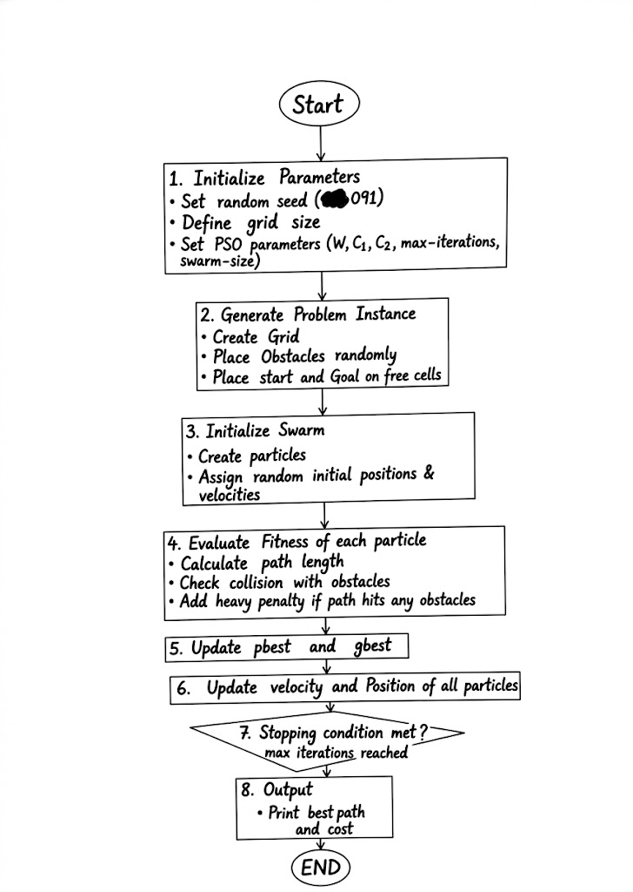
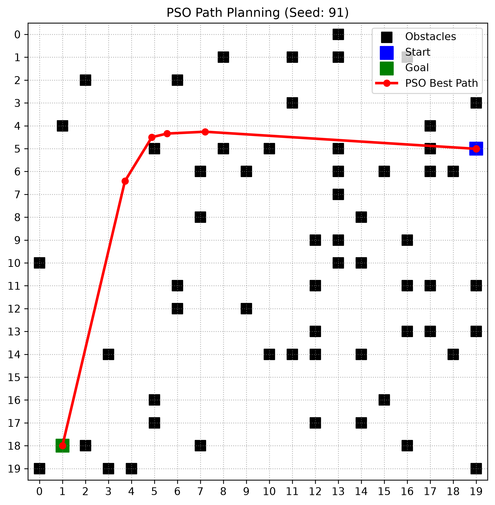

# Swarm-Based Path Planning with Obstacles

**Name:** Muhammad Danish  
**Roll Number:** 01-136232-091  
**Random Seed Used:** 91  

## Project Description
This repository implements a Particle Swarm Optimization (PSO) algorithm to solve a 2D grid path-planning problem while avoiding generated obstacles. The grid (20x20), obstacles, starting node, and goal node are all generated programmatically using a unique random seed based on my roll number to ensure a completely unique problem instance. The PSO utilizes continuous waypoints to establish the shortest, obstacle-free route across the discrete grid.

## How to Run the Code
1. Ensure you have Python installed along with the required libraries.
2. Install dependencies: `pip install numpy matplotlib`
3. Run the script: `python pso_path_planner.py` (or execute the cells sequentially if running in Jupyter/Google Colab).
4. The console will output the optimal path length, and a matplotlib window will render the 2D grid, obstacles, start/goal points, and the final converged path.

## Algorithm Flow Diagram

## Simulation Result
